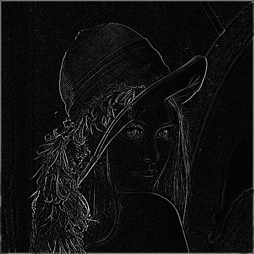
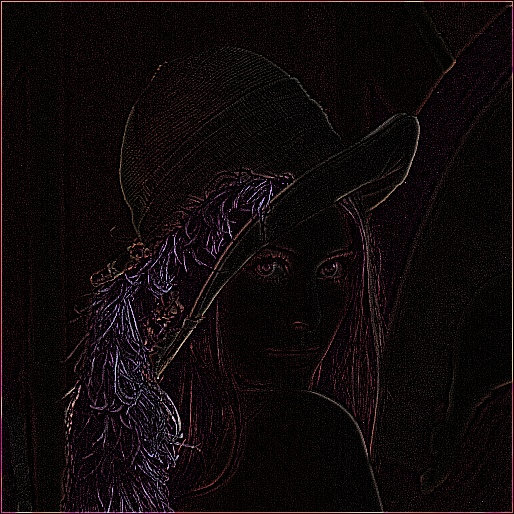

# Image Processing Tool 

### <font style="color:blue">This is a command-line image processing tool about image processing with different filters.</font>

### Some output by default : 

| Filter | Gray | RGB | HSV |
| :---: | :---: | :---: | :---: |
| `Sharpen` |  |  |  |
| `Smooth`     |  |  |  |
| `Outline`     |  |  |  |

---

### Inside, there are some files and directory :
    
>    1. [RGB.py](RGB.py) : Transfer to RGB first.

>    2. [HSV.py](HSV.py) : Transfer to HSV first.

>    3. [Gray.py](Gray.py) : Transfer to Gray Scale first. 

>    4. [main.py](main.py) : Main program to run.

>    5. [filter.json](filter.json) : Some Kernel you'd like to convolute with image.
>       *  Format would be like : 
>          ```json
>          "filter" :{
>               "1" : [[]],
>               "2" : [[]],
>               ...
>               "n" : [[]]
>          }
>            ```

>  6.   [output](iutput/) : Default output directory after processing image.

---

Simply Run below command :

```
$ python main.py --main.py --filter filter.json --image lena.jpg --choice 2
```

Also , there some helping mesage about parse arguments :

```
usage: Process Image With Some Filter Kernel. [-h] --filter
                                              path/to/filter.json --image
                                              path/to/image
                                              [--output path/to/output/directory]
                                              --choice {0,1,2}

optional arguments:
  -h, --help            show this help message and exit
  --filter path/to/filter.json
                        Enter your filter file to convolute the image.
  --image path/to/image
                        Input your image.
  --output path/to/output/directory
                        Output image to a specific directory
  --choice {0,1,2}      0 for gray image. 1 for RGB image. 2 for HSV image.
 ```

##  Here is a simply introduction of this tool.
