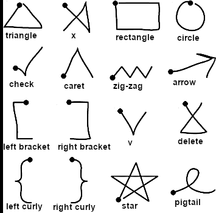

# $1 Unistroke Recognizer

Implementation of the algorithm in Python.

## Usage

The user is supposed to draw gestures on the left panel and the algorithm should recognize it.

To launch the program, you will need **python3** and **tkinter**.

The algorithm has pros ans cons. For instance, the direction of your stroke is important: if you want to draw the letter "V" but start your stroke at the top right, the algorithm will think that you drew a "caret".

## Credits

The material I used to implement this algorithm can be found online on the official website of the algorithm's authors: http://depts.washington.edu/madlab/proj/dollar/index.html

* I used their templates.
* I used their image.
* My implementation is heavily inspired by theirs.

## Templates

The following image shows the gestures that are shipped with the code. If you want to edit them or add some more, you can do it easily in the `templates.py` file.

