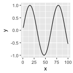

# Simple knitr Markdown example

Two examples:

* plotting
* calculating

Plot example:

```r
library(ggplot2) 
ggplot(data=data.frame(x=c(1:100),y=sin(0.1*c(1:100)))) +
   geom_line(aes(x=x,y=y))
```



Calculation example: 

```r
pi*pi
```

```
## [1] 9.869604
```
