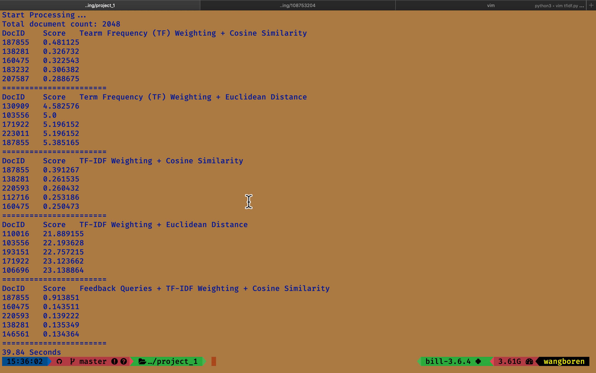

# Project 1

### Name : 王柏仁(Bill Wang)
### Student ID : 108753204
### Github Link :
https://github.com/bill0812/course_study/tree/master/web_search_mining/108753204_project

---

### 👇 Below are some details about project 1

### Outline :

- ##### Directory Tree
- ##### How to use
- ##### Some explanation
- ##### Result

---

- ### Directory Tree
    
    ```
    .
    ├── documents
    ├── Parser.py
    ├── PorterStemmer.py
    ├── VectorSpace.py
    ├── english.stop
    ├── main.py
    ├── model.pickle
    ├── tfidf.py
    └── util.py
    ```

    1. [documents/](documents/) : Some document collection that teacher gave us.
    
    2. [Parser.py](Parser.py) / [PorterStemmer.py](PorterStemmer.py): The original code that teacher release in website. I didn't modify these two a lot, only change coding style.
    
    3. [English.stop](English.stop) : English stop words.
    
    4. [main.py](main.py) : main python file to run, which I'll introduce below.
    
    5. [tfidf.py](tfidf.py) : Reference from teacher's code on course website. I add some method of "tf" and "idf" to comapre result, and adjust coding style
    
    6. [utils.py](utils.py) : Also reference from teacher's code on course website. I add some function tools to check directory if it exist or not, calculate euclidean distance, and get final query and document vector which use to calculate in similarity score.
    
    7. [VectorSpace.py](VectorSpace.py) : Also reference from teacher's code.
       But I add some function and object variable, like "get_tf_vector", "get_idf_vector", "vector_keyword_index", etc. Beside, the print-out-result function is also embeded in this.
    
    8. [model.pickle](model.pickle) : (I didn't push this to github) I save the vector space model of [documents/](documents/) in pickle file

- ### How to use

    ##### Simply run the command below :
    ```
    $ python main.py --query="drill wood sharp"
    ```
    
    ##### And some __Help__ for the [main.py](main.py):
    ```
    usage: Project 1: Search and Rank via Vector Space Models. [-h] --query 'some query'
                                                           [--tf {1,2,3}]
                                                           [--idf {1,2,3}]
    optional arguments:
        -h, --help            show this help message and exit
        
        --query 'some query'  Enter your Query.
        
        --tf {1,2,3}          Choose tf method,
                              1 for raw count.
                              2 for term frequency.
                              3 for log raw frequency.
                              Default is raw count
        
        --idf {1,2,3}         Choose idf method.
                              1 for inverse document frequency.
                              2 for inverse document frequency smooth.
                              3 for Probabilistic inverse document frequency.
                              Default is inverse document frequnecy
    ```

- ### Some Explanation

    ##### Here, I'll introduce the tfidf and utils python file, because this two play important roles in the result.

    1. [tfidf.py](tfidf.py):
            
            - raw count : 

            - term frequency : 

            - log normalization	: 

        - idf : use three method

            - inverse document frequency : 

            - inverse document frequency smooth	: 

            - probabilistic inverse document frequency :
    
    2. [utils.py](utils.py):

        - cosine : use original code that teacher gave us.

        - euclidean_dist : use numpy.linalg.norm(A-B) to get the distance

    ##### Then I'll descirbe my pipeline for dealing this project 1 :

    1. Check all input argument from command line are all right.

    2. Check if the directory is exsit.

    3. Store all document's content and its id to list (all_content, all_id).

    4. Build model from all document.

        - like teacher said: Stemming, Removing stop words, Indexing.

    5. Find each document's TF vector accroding to user's input method.

        - I use three method including raw count, term frequency, log raw count, to get vector

    6. Use 'vector_index_keyword' and 'raw_tf" in vectorSpace obejct to find IDF vector .

        - I don't use Textblob's word to find it because all keyword in vectorSpace are pre-processed, so this may be different from the Textblob's word

        - I use three method including inverse document frequency, invser  document frequency smooth, Probabilistic inverse document frequency to get idf vector.

    7. Use 'build_query_vector' in vectorSpace object to get query vector.

    8. Go through each problems.

        - I define 'ALL_OPERATION' global variable which includes:
            
            - the topic of each question

            - tfidf method

            - function

        - Depends on each question, I do some operation for multiplying idf vector when needed. Then, I'll output final query vector and document vector.

        - Especially for last question, I use the result from first query to get
          new query:

            - Get first place of result, and find its tf vector and id

            - Based on its tf vector, I use NLTK's pos_tag function and vector's index to check if the keyowrd which is retrieved from 'vector_index_vector' is noun or verb. Besides, I also check the tf value of that index is greater than one.a

            - After above, I'll asign the value of that index in new feedback query a raw count value.

            - Finally, I use __[1 * original query + 0.5 * feedback query]__ to get new query. Then use this to calculate the distance and rank it.

    9. Print out result.

- ### Result
    
    ##### Below is one of the results:
    
    
